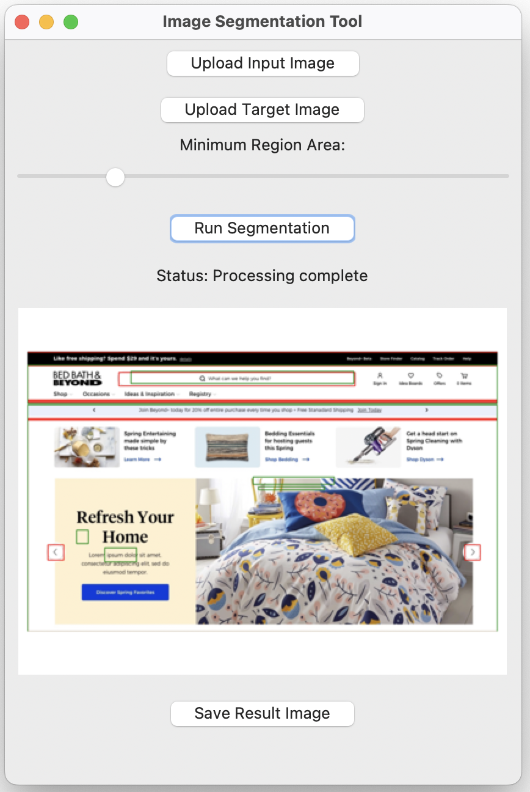
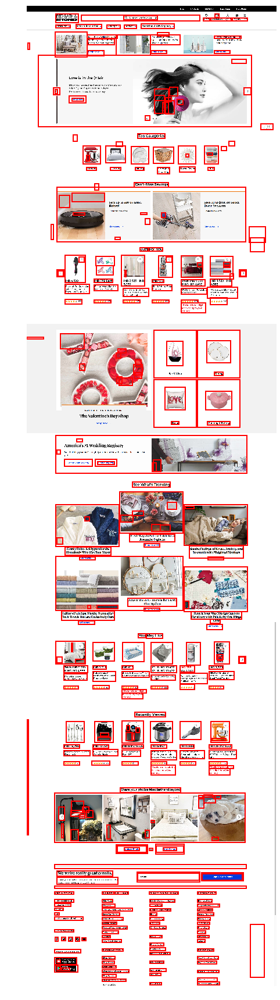
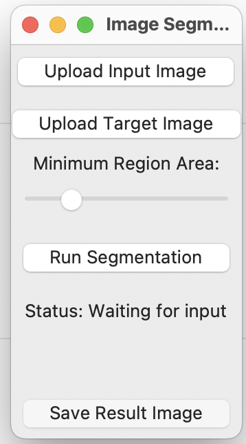
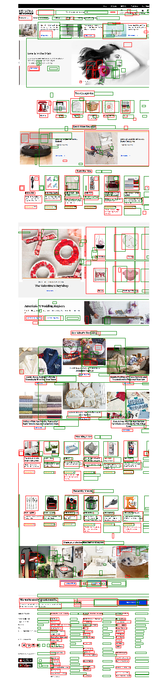

# 🎨 Design-Difference-checker (DesignDiff)

**Compare visual designs with implemented UI snapshots** — spot pixel-level differences using intelligent image segmentation.  
Designed for designers, frontend developers, and QA teams.

---

## 🚀 Overview

Design difference checker a.k.a `DesignDiff` A lightweight GUI tool compares two images — typically a **design mockup** and a **screenshot** of the actual UI — and highlights the differences between them; using image segmentation and visual diffing. Built for designers, front-end developers, and QA teams to spot pixel-level inconsistencies with ease. It uses image segmentation (via `skimage`) and visual diff overlays (via `matplotlib`) to produce quick, reliable feedback.

---

## ✨ Features

- 🖼️ Compare **input vs target** images
- 🎯 Segment-based visual diffing
- 📊 Overlay and blend views
- 🧪 No coding needed — simple GUI
- 🛠️ Built with Tkinter
- 📦 Packaged for macOS
- 🗂️ Export **comparison report** (image + bounding boxes) for sharing 

---

## 💻 Installation

### 🧳 End Users (Prebuilt App)

Download from the [Releases page](https://github.com/unosonu/Design-Difference-checker/releases) or [download directly](https://github.com/unosonu/Design-Difference-checker/releases/download/v1.0.0/design_diff.2.zip).

- `DesignDiff.2.app` (macOS)

No installation needed — just run and use.

---

### 🧑‍💻 Feedback

Provide your feedback and suggestions on additional features

---

## 📸 Screenshots

| Logical sections identification | UI Screenshot         | Visual Diff Result       |
|---------------------------------|-----------------------|---------------------------|
|    |    |  |

> ✨ The diff highlights mismatches in layout, spacing, blocks, divisions and components.

